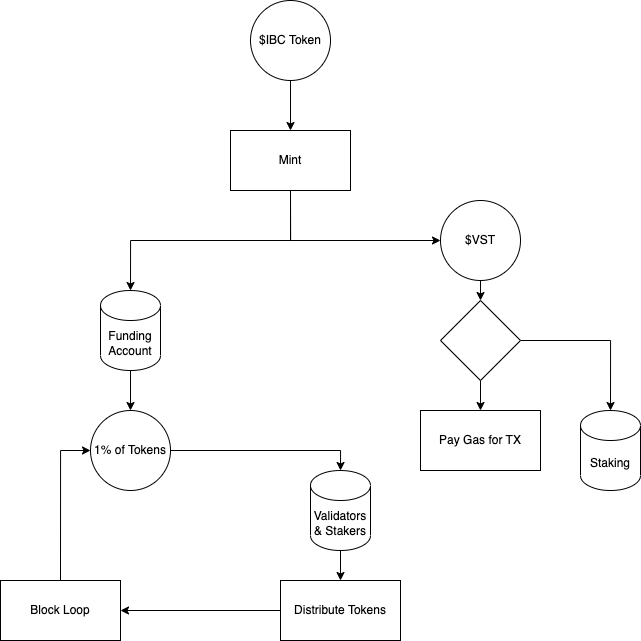

# Vesta Tokenomics

## Overview
Vesta's economic model maintains a heavy focus on protocol revenue. What this means is that the Vesta token, $VST, 
is always 100% backed by *some* asset and the validators/stakers are never paid out in $VST, instead they are paid 
out in the backing asset to prevent sell pressure. Vesta is an inflationary token, as there exists no such maximum 
supply. 

## Token Lifecycle
A Vesta Token is created when a user submits a `Mint` transaction. This transaction has one parameter, how many 
tokens the user wants to burn to make $VST. If the token the user wishes to burn is valid (part of the modules 
parameters) then these tokens will be taken from the users and given to the `funding` module's account. In exchange,
the user is given a 1:1 equivalent of newly minted $VST. This $VST can now be staked or used as a gas token by the user.

## Funding Module Pool
All tokens that are sent to the `funding` module's account are considered part of the staking pool. Every block, 1% of 
each denomination of token sitting in the pool are sent to the distribution module to be distributed amongst the 
validators and stakers.

You can see the entire process laid out in this diagram.